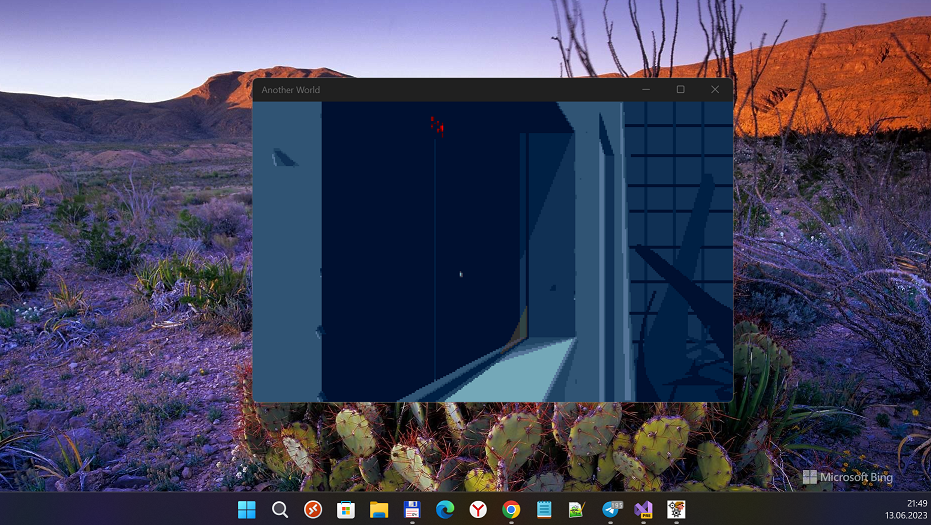

# SDLAW 1.1.2-alpha

SDL2+SDL2_Image Port to W10M 15063 (Game "AnotherWorld" is used only for RnD). Proto / Early bird 

## About SDLAW
An open-source port of Another World to Xbox One and Series consoles via UWP, based on the disassembly of the DOS version, extended with new features.

## Screenshots

## My progress
1. Sound - ok.
2. Video - ok.
3. Min. Win. OS build (SDK) = 15063.

## Running
Here are the various in game hotkeys:
- Arrow Keys allow you to move Lester
- Enter/Space allow you run/shoot with your gun
- C allow to enter a code to jump at a specific level
- P pause the game
- Alt X exit the game
- Ctrl S save game state
- Ctrl L load game state
- Ctrl + and - change game state slot
- Ctrl F toggle fast mode
- TAB change window scale factor

## TODO
1. Explore SDL features for Keyboard, Mouse, and TouchPanel. 
2. Buy some Joystick... :)

## Reference(s)
- https://github.com/fabiensanglard/Another-World-Bytecode-Interpreter "Fabother World" an interpreter for Another World (Out of this world)
- https://github.com/fabiensanglard Fabien, Neo-Row creator / Developer

## ..
AS IS. No support. RnD only. Geeks / Game developers only 

## .
[m][e] 2023

