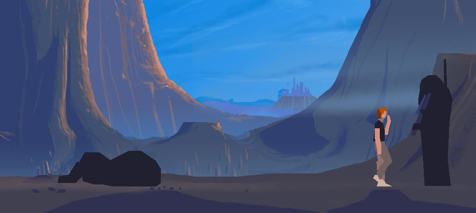

# SDLAW 1.0.8

SDL2+SDL2_Image Port to W10M 15063 (Game "AnotherWorld" is used only for RnD). Draft / Proto / Early bird 

## About UWP SDLAW
An open-source port of Another World to Xbox One and Series consoles via UWP, based on the disassembly of the DOS version, extended with new features.

## Screenshot(s)

## My progress
1. Sound - ok
2. Video - fail
3. Idk how to realize framebuffer renderring (i noticed that SDL UWP has no SDL_SetVideoMode function...) 

## Plan your own RnD :)
1. Fix the code bugs
2. Create appx 
3. Let install it at my L950 winphone for game testing ;)

## Reference(s)
- https://github.com/fabiensanglard/Another-World-Bytecode-Interpreter "Fabother World" an interpreter for Another World (Out of this world)
- https://github.com/fabiensanglard Fabien, Neo-Row creator / Developer

## ..
AS IS. No support. RnD only. Geeks / Game developers only 

## .
[m][e] 2023

